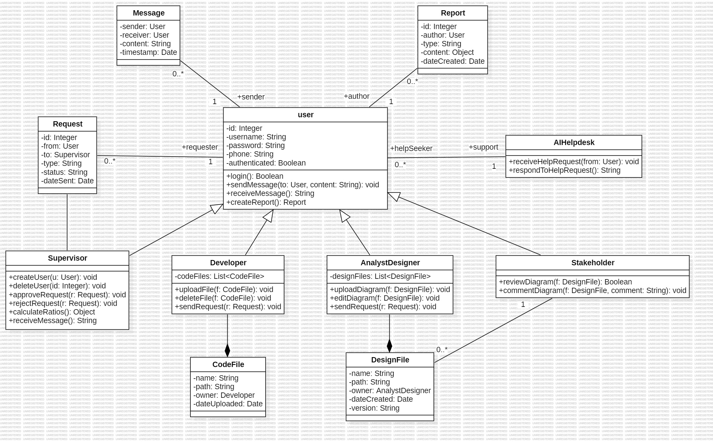

# SoftDesignProject

## Assumptions

1. **The `User` class is an abstract/general role**, acting as the superclass for `Supervisor`, `Developer`, `AnalystDesigner`, and `Stakeholder`. These roles inherit common functionality such as login, messaging, and report creation.

2. **Messaging is supported between all user types.** Each `Message` object is associated with exactly one sender and one receiver, both being instances of `User`.

3. **Reports (`Report`) are authored by users**, and their type and format vary based on the user role (e.g., text for stakeholders, UML for analysts, executable for developers).

4. **`Request` objects represent formal interactions between users and supervisors.** Every request is submitted by a `User` and addressed to a `Supervisor`, and includes status and type fields.

5. **Developers and AnalystDesigners manage files of different types.** `CodeFile` is owned by `Developer`, while `DesignFile` is owned by `AnalystDesigner`. These relationships are modeled as compositions due to ownership and lifecycle dependency.

6. **`Stakeholder` users can review and comment on diagrams only.** They are not allowed to create, edit, or delete any files themselves.

7. **The `AIHelpdesk` is an external automated system**, not a subclass of `User`. It can receive support requests from users and respond automatically through dedicated operations.

8. **The overall class design follows object-oriented principles**, such as inheritance, encapsulation, separation of concerns, and well-defined relationships (associations, compositions, generalizations).

