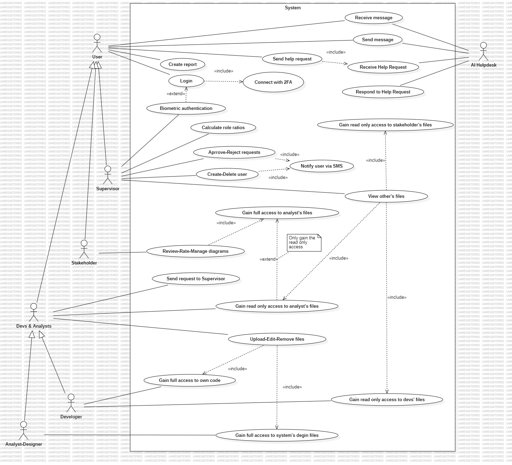
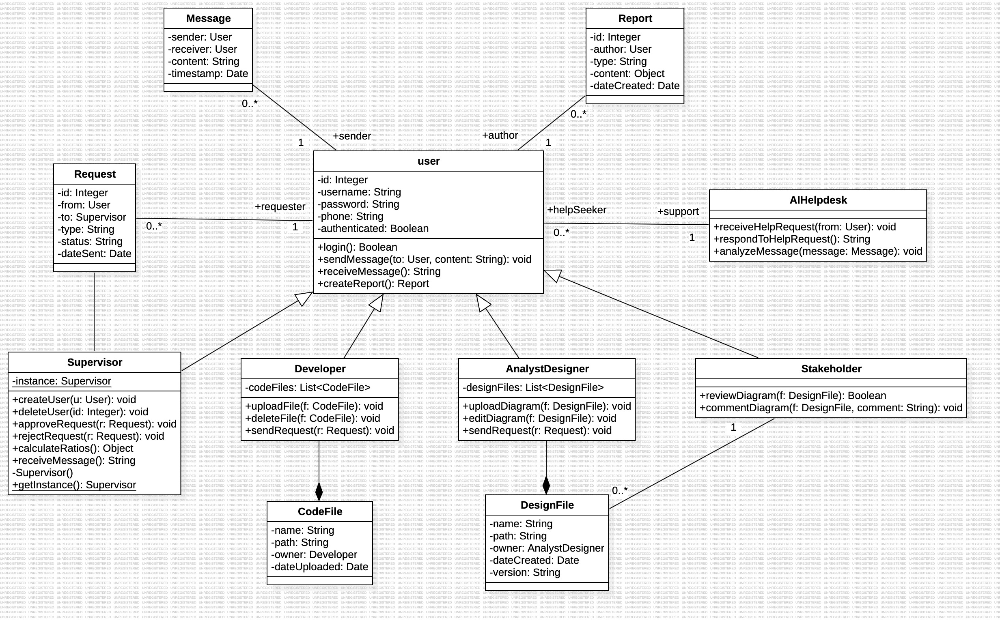
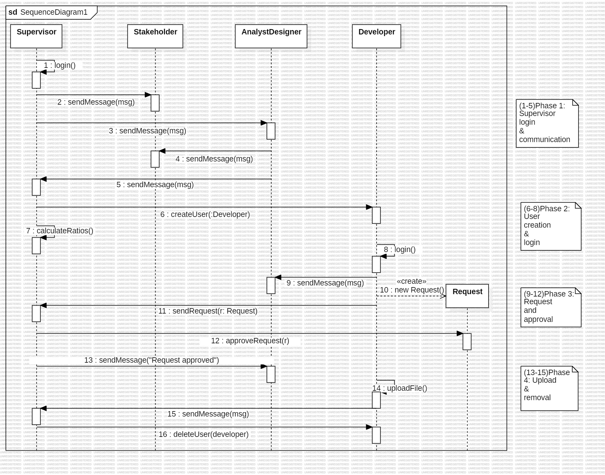
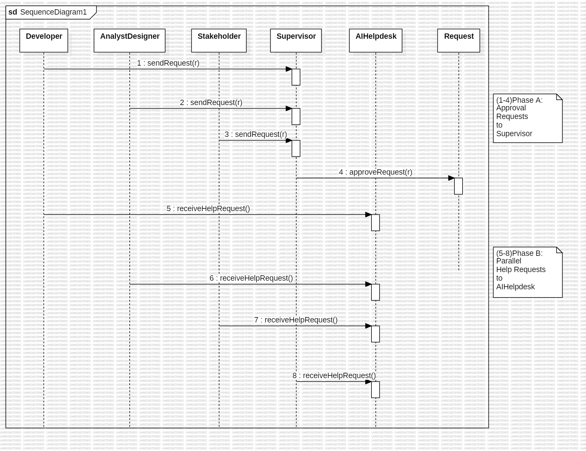
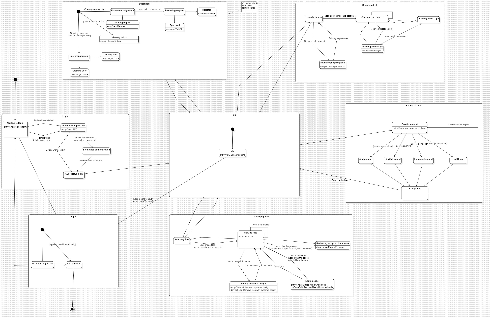
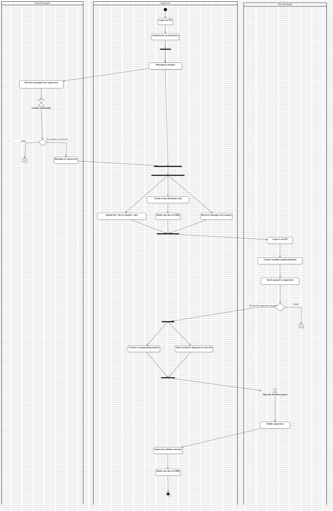
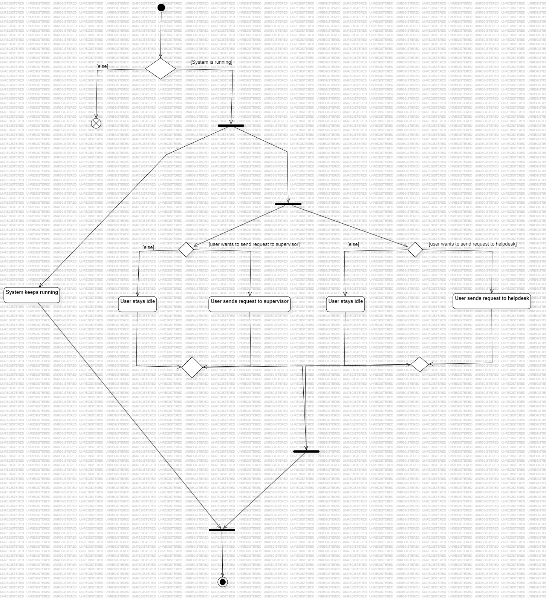
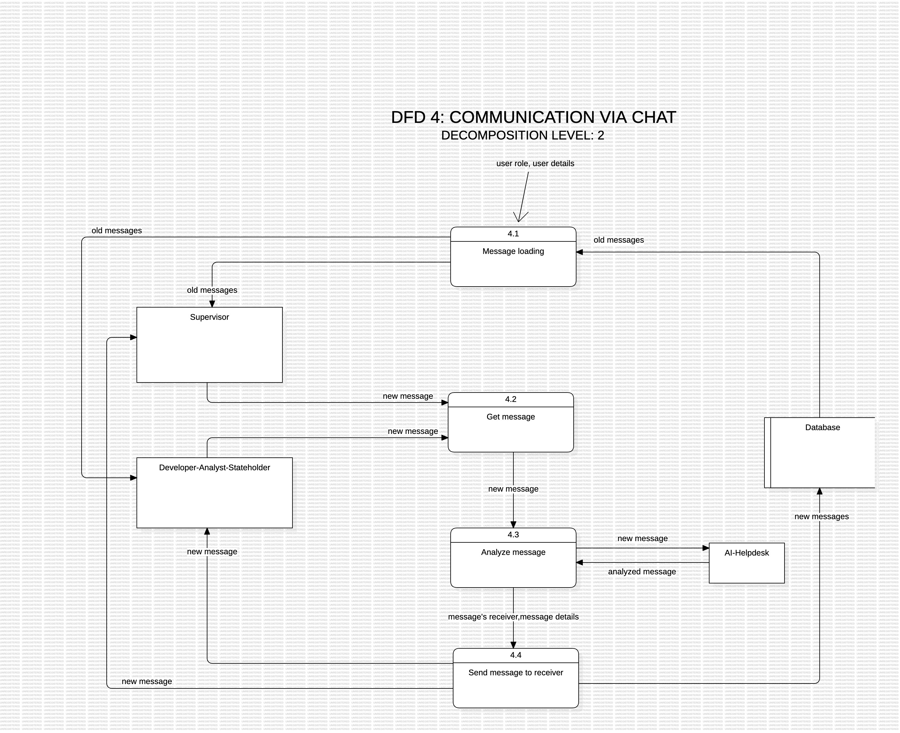

# SoftDesignProject

## Assumtpions

1. **Users are categorized into distinct roles**: Supervisor, Developer, AnalystDesigner, and Stakeholder. All of them inherit basic functionality such as authentication (via 2FA), messaging, and report creation from a general abstract actor named `User`.

2. **Two-Factor Authentication (2FA)** is considered an essential security feature and is modeled as an `<<include>>` relationship from the `Login` use case.

3. **All users can send and receive messages** within the system through a basic chat functionality. Messaging is symmetric and not limited by role.

4. **Each role has access to different types of reports and actions**, depending on their responsibilities:
   - Developers can upload/edit/delete code files.
   - Analysts can work with UML diagrams.
   - Stakeholders can review and approve diagrams.
   - Supervisors can manage users, approve requests, and calculate role ratios.

5. **Use cases such as `Send Request to Supervisor` are shared across multiple roles** (e.g., Developer, AnalystDesigner, Stakeholder), and are associated directly with each actor that can perform the action.

6. **The `AIHelpdesk` is modeled as an external actor**, which interacts with users only through predefined actions such as receiving and responding to help requests. It does not require login or access rights like internal users.

7. **Report creation is generalized but supports extensibility**, e.g., with possible `<<extend>>` use cases such as "Create Audio Report" or "Create Executable Report", depending on user role and output format.

8. **Generalization relationships are used for actors** to reduce redundancy and maintain consistency, reflecting the common actions inherited from the abstract `User` actor.

9. **Stakeholders are assumed to have only passive access**, meaning they can view, comment on, or approve diagrams, but not modify or upload content.

10. **The system boundary includes only internal functionality**, while external systems like AI Helpdesk are shown outside the system box as per UML conventions.

## Assumtpions

1. **The `User` class is an abstract/general role**, acting as the superclass for `Supervisor`, `Developer`, `AnalystDesigner`, and `Stakeholder`. These roles inherit common functionality such as login, messaging, and report creation.

2. **Messaging is supported between all user types.** Each `Message` object is associated with exactly one sender and one receiver, both being instances of `User`.

3. **Reports (`Report`) are authored by users**, and their type and format vary based on the user role (e.g., text for stakeholders, UML for analysts, executable for developers).

4. **`Request` objects represent formal interactions between users and supervisors.** Every request is submitted by a `User` and addressed to a `Supervisor`, and includes status and type fields.

5. **Developers and AnalystDesigners manage files of different types.** `CodeFile` is owned by `Developer`, while `DesignFile` is owned by `AnalystDesigner`. These relationships are modeled as compositions due to ownership and lifecycle dependency.

6. **`Stakeholder` users can review and comment on diagrams only.** They are not allowed to create, edit, or delete any files themselves.

7. **The `AIHelpdesk` is an external automated system**, not a subclass of `User`. It can receive support requests from users and respond automatically through dedicated operations.

8. **The overall class design follows object-oriented principles**, such as inheritance, encapsulation, separation of concerns, and well-defined relationships (associations, compositions, generalizations).

## Assumtpions

### General Assumptions
- The sequence diagrams align directly with the class diagram and only include objects and methods already defined in the system.
- Each lifeline in the diagram represents an active instance of a system class (e.g., `Supervisor`, `Developer`, `AnalystDesigner`, `Stakeholder`, `AIHelpdesk`, `Request`).
- Message labels match method names and, where applicable, include parameters or return types (e.g., `sendRequest(r: Request)`, `login(): Boolean`).
- The diagrams are logically divided into labeled phases (e.g., login, communication, user creation) using UML notes for better readability and semantic structure.

### Assumptions for Scenario 1
- The `Supervisor` logs in and initiates asynchronous chat interactions with the `Stakeholder` and the `AnalystDesigner` in sequence, without waiting for responses.
- The `AnalystDesigner` interacts with the `Stakeholder`, and only after successful communication responds to the `Supervisor`.
- The `createUser()` method models the instantiation of a new `Developer` instance, which then proceeds to log in and communicate with the `AnalystDesigner`.
- A `Request` object is created and submitted by the `Developer`, and subsequently approved by the `Supervisor`. Once approved, the `Supervisor` notifies the `AnalystDesigner`.
- Upon project completion, the `Developer` sends a message to the `Supervisor`, who then invokes `deleteUser()` to remove the account.
- Chat messages are assumed to be asynchronous in nature and are not required to be acknowledged before subsequent messages are sent.

### Assumptions for Scenario 2
- Multiple roles (`Developer`, `AnalystDesigner`, `Stakeholder`) can simultaneously send approval requests to the `Supervisor` without synchronization.
- The `Supervisor` processes each request independently and approves them through `approveRequest()` interactions.
- In parallel, all roles (including the `Supervisor`) can issue help requests to the `AIHelpdesk` using `receiveHelpRequest()`, without waiting for prior approvals to complete.
- Help requests are modeled as one-way calls to `AIHelpdesk`. While the system contains a `respondToHelpRequest()` method, responses are assumed to occur asynchronously or be handled outside the scope of this diagram.

## Assumtpions

1. Biometrics authentication is only meant for the supervisor.
2. There is an idle state which all the users can maintain and acts as the center(main component) of the statechart diagram.
3. The transition without text/data on them suppose that the user tapped on a button on the menu to get in that spot.
4. 2FA is required for all; biometric is an extra layer for supervisors only.
5. Supervisor is a unique user (one in the system).
6. If a user closes the app directly, it transitions to the App is closed state immediately.
7. Files and reports are role-dependent, ensuring access control and data integrity.

## Assumtpions

1. The Supervisor initiates and manages system workflows, including user account creation, diagram requests, and developer supervision. These responsibilities are part of the supervisor’s extended capabilities from the general User class.
2. AnalystDesigner users validate procedures with Stakeholders, after which they notify Supervisors of completion
3.	Developer users must request necessary design documents (e.g., DesignFile) from supervisors before starting development. These files are only distributed upon supervisor approval.
4.	Account lifecycle events (creation and deletion) are tied to SMS confirmation, indicating a tight coupling between user presence and secure access. These events are triggered solely by the supervisor.

## Assumtpions

1.	The system maintains a constant runtime check for availability, enabling or disabling user activity depending on the operational state. This availability state is queried before any interaction is allowed.
2.	User instances can send requests in parallel, either to the Supervisor or the AIHelpdesk, with no mutual exclusion or blocking. Each request is modeled as an independent interaction event.
3.	The AIHelpdesk is an external reactive component, not inheriting from User, and provides support via a predefined set of automated responses
4.	Users may choose to remain idle while the system is running, indicating that interactions are user-driven rather than forced

## Assumtpions

1.	All users must log in with a username and password, followed by a second-factor authentication (2FA) using SMS. The supervisor is additionally authenticated using biometric data.
2.	The system handles four main functional processes: User Login, User Management, File & Report Handling, and Communication via Chat, all of which interact with the central database.
3.	The supervisor is the only user allowed to manage other users (create/delete), with SMS notifications sent upon these actions.
4.	File and report formats are dependent on user roles (e.g., executable files from developers, StarUML from analysts, audio files from stakeholders, and text files from the supervisor).
5.	The communication module (chat) is available to all user types and supports interaction with both the AI Helpdesk and other users.
6.	The system maintains role-based access control, ensuring that users only have access to specific file types and actions based on their roles (e.g., read-only access for certain files).

## Assumtpions

1.	All users (Supervisor, Developer, Analyst-Designer, Stakeholder) can send and receive simple text-based messages via the chat system. The chat supports one-to-one communication based on message routing.
2.	Message history (old messages) is retrieved based on user identity and role and loaded before initiating new interactions.
3.	Every new message is passed through an analysis process that determines its content type, destination, and eligibility for AI Helpdesk processing.
4.	The AI Helpdesk acts as an intelligent external component that receives messages, processes them (if needed), and can return analyzed messages back into the system for appropriate delivery.
