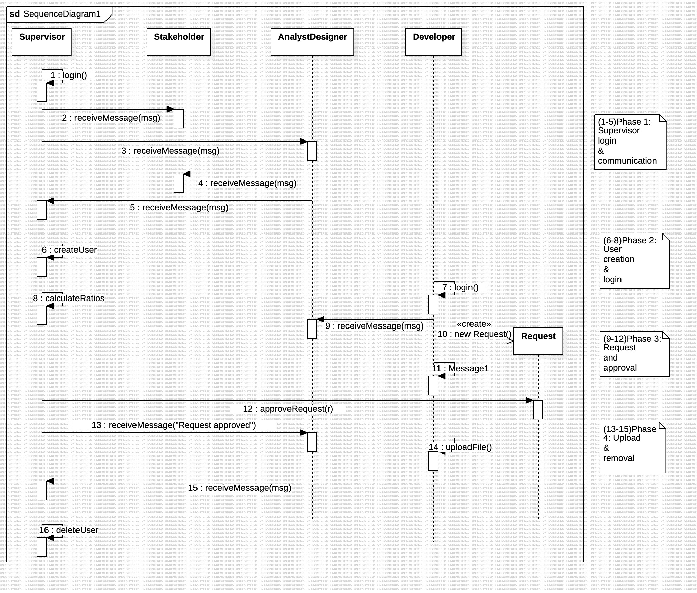
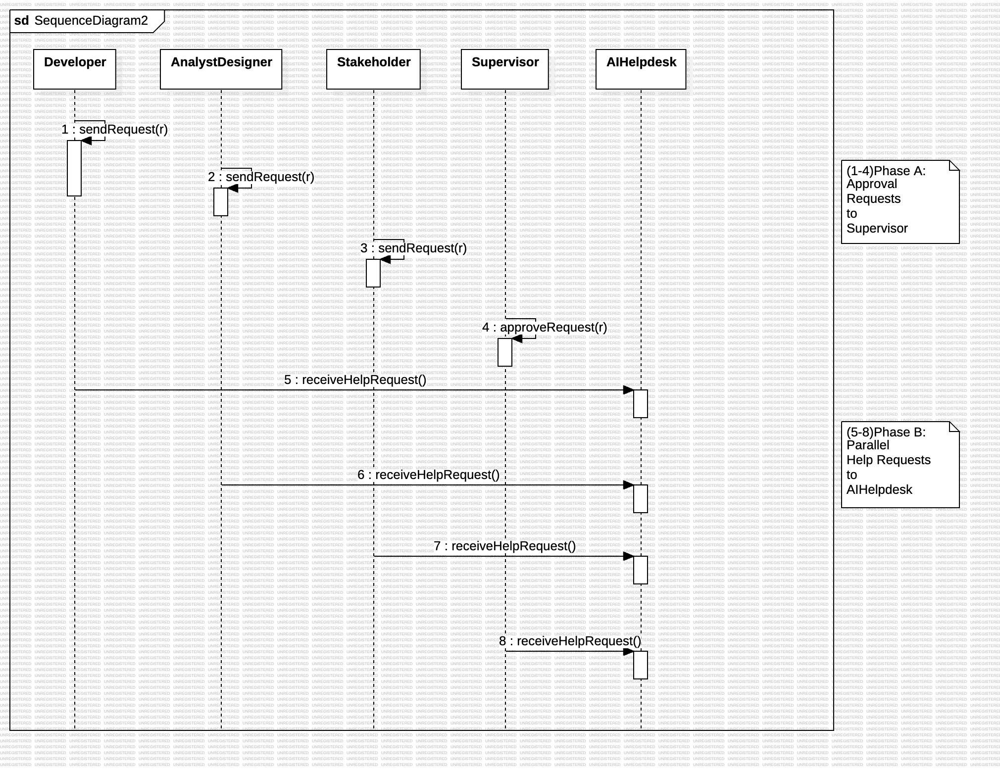

# SoftDesignProject

## Assumptions

### General Assumptions
- The sequence diagrams align directly with the class diagram and only include objects and methods already defined in the system.
- Each lifeline in the diagram represents an active instance of a system class (e.g., `Supervisor`, `Developer`, `AnalystDesigner`, `Stakeholder`, `AIHelpdesk`, `Request`).
- Message labels match method names and, where applicable, include parameters or return types (e.g., `sendRequest(r: Request)`, `login(): Boolean`).
- The diagrams are logically divided into labeled phases (e.g., login, communication, user creation) using UML notes for better readability and semantic structure.

### Assumptions for Scenario 1
- The `Supervisor` logs in and initiates asynchronous chat interactions with the `Stakeholder` and the `AnalystDesigner` in sequence, without waiting for responses.
- The `AnalystDesigner` interacts with the `Stakeholder`, and only after successful communication responds to the `Supervisor`.
- The `createUser()` method models the instantiation of a new `Developer` instance, which then proceeds to log in and communicate with the `AnalystDesigner`.
- A `Request` object is created and submitted by the `Developer`, and subsequently approved by the `Supervisor`. Once approved, the `Supervisor` notifies the `AnalystDesigner`.
- Upon project completion, the `Developer` sends a message to the `Supervisor`, who then invokes `deleteUser()` to remove the account.
- Chat messages are assumed to be asynchronous in nature and are not required to be acknowledged before subsequent messages are sent.

### Assumptions for Scenario 2
- Multiple roles (`Developer`, `AnalystDesigner`, `Stakeholder`) can simultaneously send approval requests to the `Supervisor` without synchronization.
- The `Supervisor` processes each request independently and approves them through `approveRequest()` interactions.
- In parallel, all roles (including the `Supervisor`) can issue help requests to the `AIHelpdesk` using `receiveHelpRequest()`, without waiting for prior approvals to complete.
- Help requests are modeled as one-way calls to `AIHelpdesk`. While the system contains a `respondToHelpRequest()` method, responses are assumed to occur asynchronously or be handled outside the scope of this diagram.
