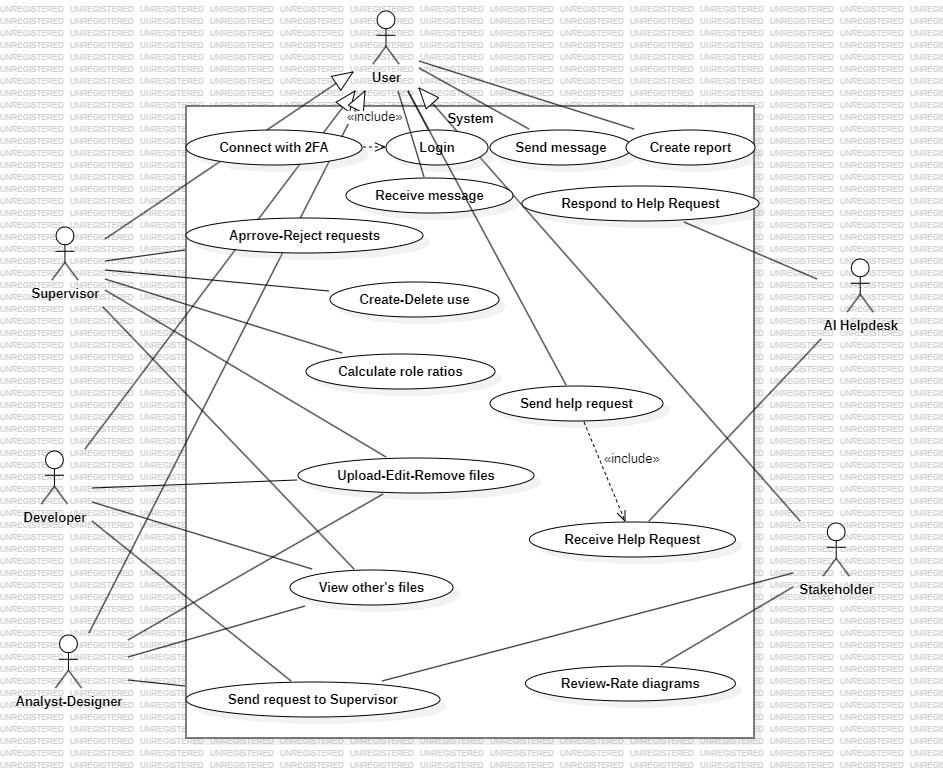
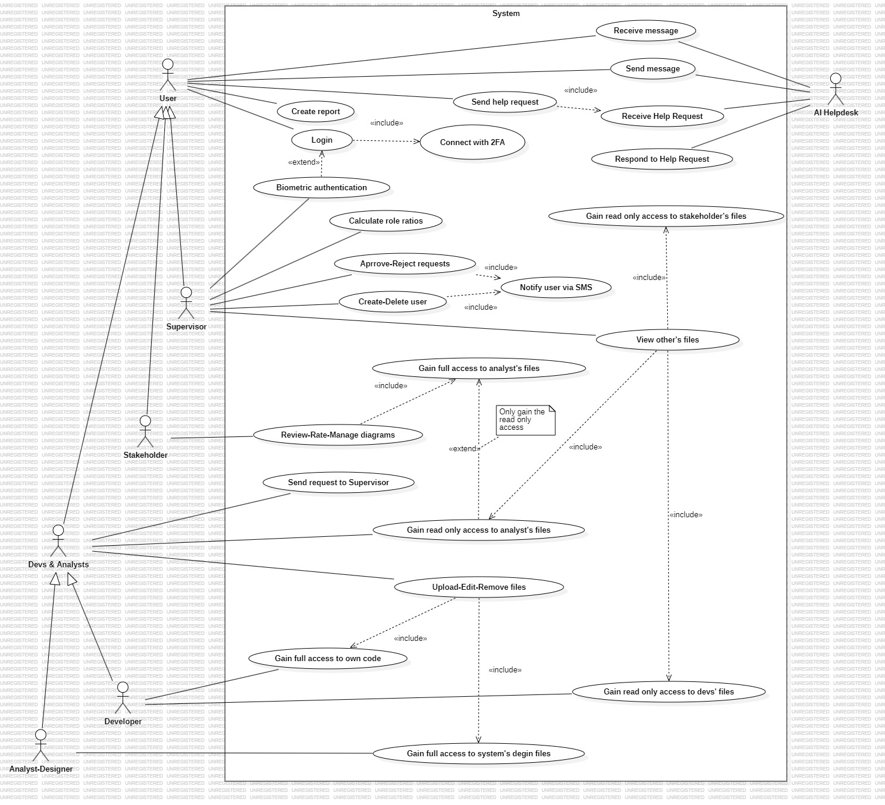

# SoftDesignProject

 
## Assumptions

### 1. **Users are categorized into distinct roles**: Supervisor, Developer, AnalystDesigner, and Stakeholder. All of them inherit basic functionality such as authentication (via 2FA), messaging, and report creation from a general abstract actor named `User`.

### 2. **Two-Factor Authentication (2FA)** is considered an essential security feature and is modeled as an `<<include>>` relationship from the `Login` use case.

### 3. **All users can send and receive messages** within the system through a basic chat functionality. Messaging is symmetric and not limited by role.

### 4. **Each role has access to different types of reports and actions**, depending on their responsibilities:
   - Developers can upload/edit/delete code files.
   - Analysts can work with UML diagrams.
   - Stakeholders can review and approve diagrams.
   - Supervisors can manage users, approve requests, and calculate role ratios.

### 5. **Use cases such as `Send Request to Supervisor` are shared across multiple roles** (e.g., Developer, AnalystDesigner, Stakeholder), and are associated directly with each actor that can perform the action.

### 6. **The `AIHelpdesk` is modeled as an external actor**, which interacts with users only through predefined actions such as receiving and responding to help requests. It does not require login or access rights like internal users.

### 7. **Report creation is generalized but supports extensibility**, e.g., with possible `<<extend>>` use cases such as "Create Audio Report" or "Create Executable Report", depending on user role and output format.

### 8. **Generalization relationships are used for actors** to reduce redundancy and maintain consistency, reflecting the common actions inherited from the abstract `User` actor.

### 9. **Stakeholders are assumed to have only passive access**, meaning they can view, comment on, or approve diagrams, but not modify or upload content.

### 10. **The system boundary includes only internal functionality**, while external systems like AI Helpdesk are shown outside the system box as per UML conventions.
